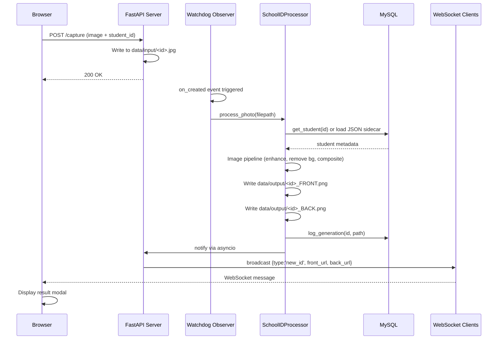

# ID Automation System — Technical Documentation

## Overview

Local FastAPI application that generates ID card images (front/back PNG) by compositing captured photos and student metadata onto configurable templates.

**Architecture**: File-watcher pipeline with WebSocket notification.

**Stack**: FastAPI + Watchdog + OpenCV + PIL + MySQL + optional ML enhancements (MediaPipe, GFPGAN, rembg).

---

## System Architecture

### Sequence Diagram



### Components

- **API Server**: FastAPI on Uvicorn, serves static HTML, handles uploads, manages WebSocket connections.
- **Watchdog Observer**: Monitors `data/input/` for new image files, triggers processing.
- **SchoolIDProcessor**: Image enhancement pipeline and template compositing.
- **MySQL**: Student records and generation history.
- **Frontend**: Static HTML + vanilla JS, uses WebSockets for live updates.

---

## Repository Structure

```
run.py                  # Entrypoint (starts Uvicorn)
app/
  api.py                # Routes, WebSocket, Watchdog integration
  school_id_processor.py# Image processing pipeline
  database.py           # MySQL connection and queries
  glam_engine.py        # Optional ML-based enhancements
data/
  input/                # Captured photos (triggers processing)
  output/               # Generated ID card PNGs
  templates/            # Template background images
  layout.json           # Field positioning and styling
  settings.json         # Active templates and options
tools/
  reset_db.py           # Database schema reset
  import_csv.py         # Bulk import from CSV
web/
  index.html            # Capture station UI
  dashboard.html        # Admin UI
  editor.html           # Layout editor UI
```

---

## Configuration

### Environment Variables

Database connection (defaults provided for local development):
- `DB_HOST` (default: `localhost`)
- `DB_USER` (default: `root`)
- `DB_PASSWORD` (default: empty - **set this in production**)
- `DB_NAME` (default: `school_id_system`)

### Settings (`data/settings.json`)

```json
{
  "active_template_front": "template_front.png",
  "active_template_back": "template_back.png",
  "smooth_strength": 5
}
```

### Layout (`data/layout.json`)

Defines pixel coordinates for photo box and text fields:

```json
{
  "front": {
    "photo": {"x": 63, "y": 201, "w": 465, "h": 465},
    "name": {"x": 297, "y": 682, "size": 30, "color": "#f34f4f", "bold": true, "align": "center"},
    "lrn": {"x": 274, "y": 743, "size": 18, "color": "#000000", "align": "left"}
  },
  "back": {
    "guardian_name": {"x": 175, "y": 149, "size": 30, "color": "#000000", "align": "left"}
  }
}
```

---

## Database Schema

### `students`

| Column            | Type         | Notes              |
|-------------------|--------------|--------------------|
| id_number         | VARCHAR(50)  | Primary Key        |
| full_name         | VARCHAR(100) |                    |
| lrn               | VARCHAR(50)  | Learner Reference  |
| grade_level       | VARCHAR(20)  |                    |
| section           | VARCHAR(50)  |                    |
| guardian_name     | VARCHAR(100) |                    |
| address           | VARCHAR(255) |                    |
| guardian_contact  | VARCHAR(50)  |                    |

### `generation_history`

| Column      | Type         | Notes                  |
|-------------|--------------|------------------------|
| id          | INT          | Auto-increment         |
| student_id  | VARCHAR(50)  |                        |
| file_path   | VARCHAR(255) |                        |
| timestamp   | DATETIME     | Default CURRENT_TIMESTAMP |

---

## API Reference

Base: `http://localhost:8000`

### Pages

- `GET /` → Capture Station
- `GET /dashboard` → Admin Dashboard
- `GET /editor` → Layout Editor

### Configuration

- `GET /layout` → Returns layout JSON
- `POST /layout` → Updates layout JSON
- `GET /settings` → Returns settings JSON
- `POST /settings` → Updates settings and reloads processor

### Templates

- `GET /templates/list` → Lists available PNG templates
- `POST /templates/upload` → Uploads a template (multipart/form-data)

### Students

- `GET /students` → Lists all students
- `POST /students/update` → Updates student record (JSON body)
- `GET /history` → Last 50 generations (joined with student data)
- `POST /regenerate/{student_id}` → Reprocesses existing input photo

### Capture

- `POST /capture` (multipart/form-data)
  - Required: `file` (image), `student_id`
  - Optional: `manual_name`, `manual_grade`, `manual_section`, `manual_guardian`, `manual_address`, `manual_contact`

When manual fields are provided, a sidecar JSON is written to `data/input/<id>.json` which overrides database values.

### WebSocket

- `GET /ws` → Broadcasts `{type: 'new_id', student_id, front_url, back_url}` on completion

---

## Image Processing Pipeline

1. **Input**: New file detected in `data/input/`
2. **Data resolution**: Check for sidecar JSON → query DB → fallback to UNKNOWN
3. **Enhancement** (optional, based on installed libraries):
   - Hair cleanup (MediaPipe segmentation + aggressive erosion)
   - Face restoration (GFPGAN v1.4)
   - Bilateral smoothing
   - Skin smoothing + makeup effects
4. **Background removal**: rembg with alpha matting
5. **Compositing**: Resize/crop photo to layout specs, draw text fields onto template
6. **Output**: Write `<id>_FRONT.png` and `<id>_BACK.png` to `data/output/`
7. **Logging**: Insert record into `generation_history`
8. **Notification**: Broadcast WebSocket event

---

## Installation (Windows)

### Prerequisites

- Python 3.10+
- MySQL Server (local or network)
- Camera device

### Setup

1. Clone repo and create virtual environment:
```powershell
python -m venv .venv
.\.venv\Scripts\Activate.ps1
```

2. Install dependencies:
```powershell
pip install -r requirement.txt
```

Note: ML dependencies (Torch, GFPGAN, MediaPipe) are large and may require specific CUDA/GPU configurations.

3. Configure database:

Option A: Use environment variables (recommended)
```powershell
$env:DB_HOST="localhost"
$env:DB_USER="school_admin"
$env:DB_PASSWORD="your_secure_password"
$env:DB_NAME="school_id_system"
```

Option B: Defaults (root with empty password on localhost - development only)

4. Initialize database:
```powershell
python -c "from app.database import init_db; init_db()"
```

5. (Optional) Import students from CSV:
```powershell
python tools/import_csv.py
```

Expected CSV columns: `ID_Number`, `Full_Name`, `LRN`, `Grade_Level`, `Section`, `Guardian_Name`, `Address`, `Guardian_Contact`

6. Run server:
```powershell
python run.py
```

Server binds to `0.0.0.0:8000` with auto-reload enabled (development mode).

---

## Deployment Considerations

### Security

- Add authentication before exposing to network
- Configure CORS restrictions (currently `allow_origins=["*"]`)
- Use environment variables for database credentials
- Implement file size limits on uploads
- Review retention policy for captured photos (PII)

### Performance

- File watcher uses `time.sleep(0.5)` for write stability (not production-grade)
- Single-threaded processing (no queue, no parallelization)
- First run may download ML models (can cause delays)

### Reliability

- No automatic retries on processing failures
- Frontend error handling is minimal (many silent failures)
- No health check endpoints

---

## Troubleshooting

### Templates not appearing

- Verify templates exist in `data/templates/`
- Check `data/settings.json` references valid filenames
- Check console for "Template file not found" errors

### Processing not triggering

- Check console for "New photo detected" message
- Verify file is written to `data/input/` with correct extension (.jpg, .jpeg, .png)
- Check for errors during model loading (first run)

### Database errors on edit/save

- Verify MySQL connection is active
- Check environment variables if using custom DB config
- Confirm database schema is up to date

---

## Development

### Running Tests

(Tests not yet implemented)

### Code Structure

- `app/api.py`: All routes, lifecycle management, Watchdog setup
- `app/school_id_processor.py`: Core processing logic, isolated from web layer
- `app/database.py`: All database access

### Adding New Fields

1. Update `data/layout.json` with field coordinates
2. Update database schema if persisting to DB
3. Update `get_student_data()` in processor to include new field
4. Update frontend forms and display logic

---

## Known Limitations

- Auto-reload mode can spawn duplicate watchers
- No job queue (processing is synchronous)
- Canvas scale in editor is hard-coded (0.7)
- Tailwind/fonts loaded from CDN (requires internet)
- CSV import expects specific column names
